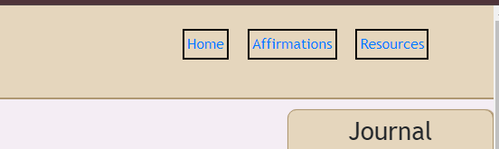
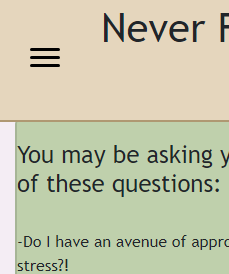
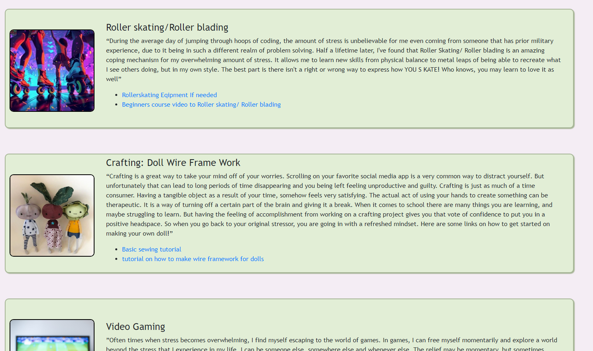
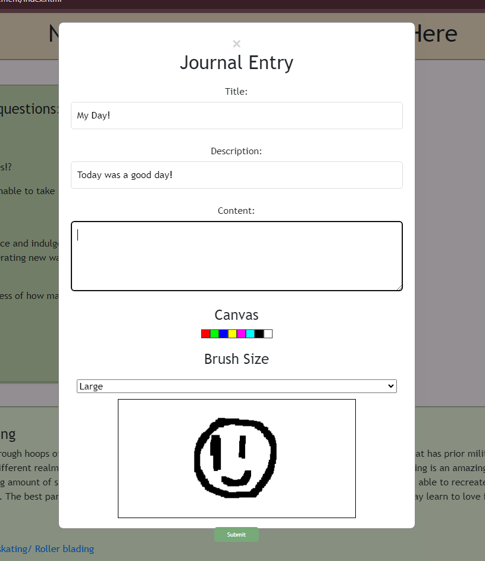
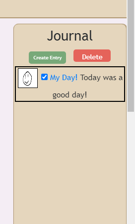

# Stress-Management
## Description

- Motivation: We wanted to provide a place for a wide variety of individuals that are under the pressure of stress to be able to both vent their challenges through diary format and also take inpiration from our weekly updated stress management options.

- To create a  hands-on ready variety of strategies to manage stress  and prompt a  healthy, mental and physical environment. 

- The site creates a collection of resources and tools  to maintain a healthy balance of mental all within one browser. Easy access to multitude of strategies allow those that are looking for assistance to locate any helpful sources quickly. The site also allows the user a personal space to decompress through private journals and a creative space for drawing. 

- From this project we as a team learned how to organize structures, styles ,  and create logic to assign purpose and function to elements of a webpage through the use of HTML, CSS, and Javascript. The undertaking of a large project such as thi,s allowed us to utilize teamwork and collaboration to piece together a functioning website. Along the way our team encountered problems that pushed our creativity and logic to find solutions.  The problems and issues that we faced, pushed us to deepdive into self-learning new concepts and methods. In the overall process gave us an insight into the fundamentals of a program developer. 

- Our friendly user interface and tools are quick  and easy to navigate. The site is peronable and creative in its effort relieve the stress of everyday people. The site provides easy access to sources as well as tools the user can use to decompress from a long and stressful day. This site was built and concieved to aleviate the user from the daily dregs of life by creating a personal space built by developers that know all too well the experience and effects of stress on the mind and body. 
##Table of Contents

## Table of Contents
- [Description](#description)
- [Installation](#installation)
- [Usage](#usage)
- [Credits](#credits)

## Installation

The website is easy deployed by navigating through the url:"placeholder" 

## Usage

The website provides links that in the right side navbar that will relocate you to your desired destination on the browser.

When the display is resized to a different medium the navbar will disappear and the hamburger menu will appear.

On the main page the user will be greeted with developer curated cards that provide a description on their go-to methods and strategies of decompressing from stress. 

On the sidebar a personal journal can be found. If the user wishes to create a personal account of their day or log their emotions a simple click on the create entries will propagate a modal the will contains a form in which the user will be able to enter their thoughts and emotions through text entries or by drawing on the canvas. 

Once submitted the journals will be saved and displayed on the side forum, in which the user may delete unwanted journals by checking all posts they wish to clear and pressing the delete button.  

## Credits

- Collaborators 
    - Larissa Mae 
        - Github:  https://github.com/keenanmaupin
    - Keenan Maupin 
        - Github: https://github.com/larimae
    - Andres Armenta 
        - Github: https://github.com/IIAndr3sII
    - Vuong Luu 
        - Github: https://github.com/vluu11

- Sources
    - https://www.rollerblade.com/usa/en?srsltid=AfmBOornL2BTwge7Vq9--7KerBVbg4Pzg9_MRw2f4b3DLsDyc8L7eDDk
    - https://www.youtube.com/watch?v=MJe7ymvR3pU
    - https://www.wikihow.com/Sew
    - https://www.ballyhoocreations.com/post/making-wire-armatures-to-pose-any-doll-or-create-stop-motion-puppets
    - https://store.steampowered.com/
    - https://www.riotgames.com/en
    - https://www.youtube.com/watch?v=gC_L9qAHVJ8
    - https://www.costco.com/exercise-fitness.html
    - https://www.seriouseats.com/mission-style-burrito-carne-asada
    - https://www.foodandwine.com/recipes/classic-cheeseburgers
    - https://simply-delicious-food.com/easy-tomato-soup-recipe/
    - https://www.tacobell.com/food/deals-and-combos/luxe-cravings-box?gad_source=1&gclid=CjwKCAjwooq3BhB3EiwAYqYoEoS
    - https://www.webmd.com/balance/stress-management/stress-relief-breathing-techniques
    - https://www.mayoclinic.org/healthy-lifestyle/stress-management/resources/hlv-20049495?p=1

